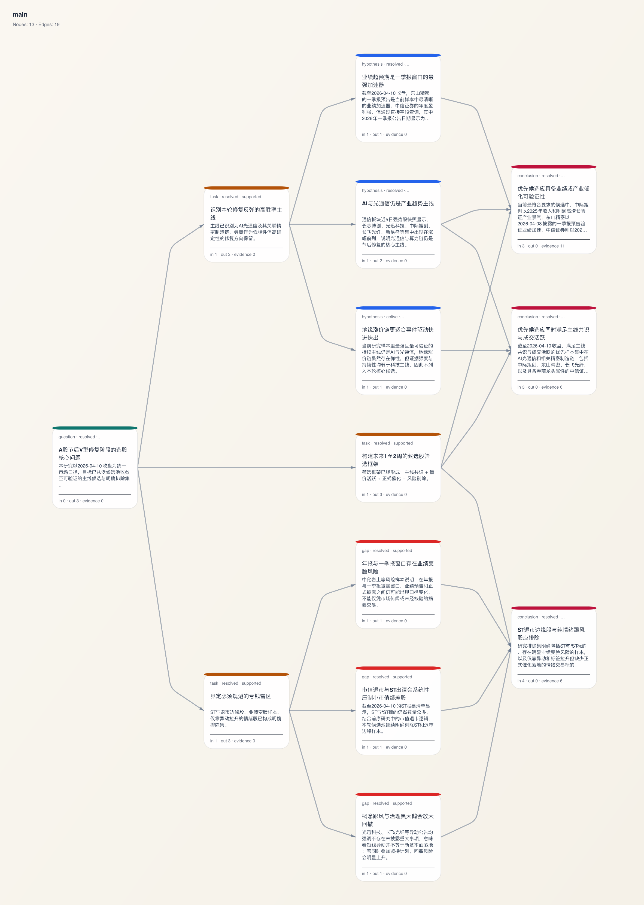

# A-DECIMA

> 基于 CLI 的 AI 驱动股票研究框架 (AI-driven stock research framework)。集成 `iwencai`（数据源）+ `deep-research`（DAG研究路径管理），结构化执行从数据抓取、分析、质量检查到报告导出的完整投研流程。  
>
> 能力边界: 数据基于问财的基础行情数据、新闻、研报。因缺乏历史数据的获取来源不具备回测能力。  

## 基于 CLI 的选股助手

1、使用方法复制下方YAML模版到 Codex / CC 先让其完成冷启动安装  

```md
{{下方 YAML 的内容}}

完成冷启动, 安装 iwencai 或 deep-research 两个CLI工具
```

2、然后让其基于模版流程创建基于某种策略的股票选股研究  

```md
{{下方 YAML 的内容}}

基于通用策略研究标准流程模版, 结合如下研究:

{{选股策略/调研/想法}}
 
新建策略研究流程到新的项目文件夹下的YAML文件中.
```

3、开始研究, 设置研究深度和预算

```md
完整阅读: <步骤2新建的YAML文件路径>

研究深度为DAG深度4，总节点数<50.
开始进行，按步骤一直执行到研究满足要求时停止, 返回最终报告与 DAG。
```

## 示例

<!-- markdownlint-disable MD033 -->

<!-- markdownlint-enable MD033 -->  

[报告预览-没有特别要求大纲-GPT随机的大纲结构](./assets/report.md)

基于模型: GPT-5.4-xhigh

## 研究模版

```yaml
execution_protocol:
  name: "通用策略研究标准流程"
  version: "1.4"
  intended_use: >
    适用于先完成研究设计与边界确认，再使用 deep-research 管理研究状态、
    证据链、报告工件与 DAG，同时结合 deepseek 做公开网页搜索、
    iwencai query2data 做结构化数据抓取、iwencai search 做问财体系内公告 /
    新闻 / 研报 / 投关检索的通用策略研究任务。

  parameters:
    target_entity: "<研究对象，例如：新能源汽车行业 / 铜期货 / 某宏观指标 / 某只股票>"
    entity_code: "<对象代码，如果有，例如：申万行业代码 / 期货合约代码 / 股票代码>"
    benchmark_date: "<研究基准日 YYYY-MM-DD>"
    research_question: "<核心研究问题，例如：未来半年该资产的供需缺口与价格推演>"
    time_scope: "<时间范围，例如：近5年 / 最近3个完整年度 / 最近1周>"
    audience: "<报告对象，例如：投研内部 / 投委会 / 客户简报 / 个人投资者>"
    focus_dimensions:
      - "<核心维度1，例如：宏观政策与产业周期>"
      - "<核心维度2，例如：基本面供需格局>"
      - "<核心维度3，例如：量价特征与资金面>"
      - "<核心维度4，例如：尾部风险与黑天鹅>"

  guiding_principles:
    - "研究设计先于 init；未明确边界前不进入正式研究状态"
    - "deep-research 是唯一研究容器；任何关键结论都必须回写到 node / evidence / artifact，而不是停留在终端输出"
    - "deepseek 是公开网络搜索主工具；默认先扫公开网页，再回到结构化数据和正式内容核验"
    - "iwencai query2data 是结构化数值主入口；行情、估值、量价、资金流、板块、历史序列优先用它"
    - "iwencai search 负责问财体系内的公告、新闻、研报、投关检索；它不是 deepseek 的可选替代，而是正式内容层"
    - "官方/权威原文与 query2data 数值优先于二手摘要；deepseek 输出默认是候选证据，不单独支撑最终结论"
    - "每条 iwencai 命令尽量只表达一个意图；多主体、多时间窗、多频道时拆成多条"
    - "若对某 CLI 的能力或命令面不确定，先执行对应 skillbook / --help，再进入正式研究"
    - "严格闭环默认包含 graph_snapshot、run --mode synthesize/review/complete 与 gate_check"
    - "最终报告优先使用 evidence 脚注引用，而不是裸链接堆叠"

  tool_mental_model:
    default_stack:
      - "deepseek -> 公开网页搜索、候选链接发现、网页级补充阅读"
      - "iwencai query2data -> 结构化数据、行情、估值、量价、资金、板块、历史序列"
      - "iwencai search -> 问财体系内公告、新闻、研报、投关材料检索"
      - "deep-research -> 研究设计、状态容器、DAG、evidence、artifact、gate、export"
    do_not_confuse:
      - "deepseek 不是结构化数据库，不应用来主查量价、估值、资金流、板块排名"
      - "iwencai query2data 不是开放网页搜索，不应用来替代公开网页线索发现"
      - "iwencai search 不是 query2data；它负责内容文档检索而不是数值筛选"
      - "deep-research 不负责替代搜索引擎；它负责把研究过程结构化、可审计化"

  tool_roles:
    deepseek:
      responsibility:
        - "公开网页搜索"
        - "开放网络线索发现"
        - "候选链接清单整理"
        - "跨站点补充阅读与摘要压缩"
      boundaries:
        - "不是结构化行情数据库"
        - "输出可能混入 search result set、聚合摘要、转载、自媒体内容"
        - "若不回到原始链接核验，不应直接支撑投资结论"
      runtime_notes:
        - "依赖本机 Chrome / Chromium 登录态，不是裸 HTTP 客户端"
        - "首次运行先执行 plan，确认浏览器运行时"
        - "投研默认命令使用 --clone-chrome-profile --headless --search on --deep-think on --quiet --format text"
      baseline_trust: "低到中；更适合作为候选证据或线索发现器"
      preferred_commands:
        - "plan"
        - "skillbook"
        - "reply --clone-chrome-profile --headless --search on --deep-think on --quiet --format text"
      default_query_style:
        - "请联网检索并概括截至 <benchmark_date> 最近一周最关键的 4 条催化和 4 条风险，优先公司公告、权威媒体、券商研报摘要"
        - "请列出最值得二次核验的 5 个公开网页链接，并标明来源类型，不要直接给投资建议"
        - "请比较 A 公司与可比公司在公开网页中的主要叙事差异"
    iwencai_query2data:
      responsibility:
        - "当前截面数据抓取"
        - "历史时间序列数据抓取"
        - "筛选、排序、横向比较"
      boundaries:
        - "不是开放网页搜索"
        - "对长篇研报、公告正文、媒体解读并不擅长"
      authoring_rules:
        - "使用短句式金融 DSL，而不是闲聊式自然语言"
        - "一条命令尽量一个意图"
        - "多指标、多时间窗时拆分查询"
      baseline_trust: "中到高；数值型主证据"
      preferred_commands:
        - "query2data"
        - "skillbook"
      default_query_style:
        - "<target_entity> 最新 <核心指标>"
        - "<target_entity> <time_scope> <核心指标序列>"
        - "<板块/主题> 近5日涨跌幅 主力净买入额"
    iwencai_search:
      responsibility:
        - "问财体系内公告检索"
        - "问财体系内新闻检索"
        - "问财体系内研报检索"
        - "问财体系内投关检索"
      boundaries:
        - "不是开放网页全网搜索"
        - "不是结构化数值主查询"
      authoring_rules:
        - "尽量单主体、单频道、单内容类型"
        - "优先显式指定 channel"
        - "多公司、多主题时拆成多条"
      baseline_trust: "中到高；正式内容检索层"
      preferred_commands:
        - "search"
        - "skillbook"
      default_query_style:
        - "<target_entity> 公告"
        - "<target_entity> 新闻"
        - "<target_entity> 研究报告"
        - "<target_entity> 投资者关系活动"
    deep_research:
      responsibility:
        - "研究设计确认、初始化与节点建模"
        - "证据固化、核验、挂载与版本快照"
        - "研究报告写作、生命周期推进与 DAG 管理"
        - "门禁检查与最终导出"
      boundaries:
        - "不是公网搜索引擎"
        - "不是结构化行情接口"
      baseline_trust: "状态容器，不直接产生事实证据"
      preferred_commands:
        - "status / doctor / skillbook / init"
        - "node_add / node_update / node_resolve"
        - "evidence_archive / evidence_add / evidence_verify / evidence_link"
        - "graph_link / graph_snapshot / graph_export / graph_visualize"
        - "artifact_add / artifact_export"
        - "run --mode plan / evidence / synthesize / review / complete"
        - "gate_check / export"
    shell:
      responsibility:
        - "缺失 CLI 时执行冷启动安装与 sidecar 初始化"
        - "命令调度与本地 JSON / TXT / HTML / PNG 落盘"
        - "按研究 slug 组织 .research-data 目录产物"

  evidence_trust_model:
    level_1_high:
      - "交易所 / 监管 / 统计局 / 官方数据库 / 公司原文 / 巨潮 / 官方 IR 页面"
      - "iwencai query2data 中可直接复核的结构化数值"
    level_2_medium_high:
      - "iwencai search 返回的正式公告、投关、新闻、研报条目"
      - "权威媒体原文、正式研报页面"
    level_3_medium:
      - "deepseek 找到并已回到原始网页核验的公开网页内容"
    level_4_low_medium:
      - "deepseek 输出的聚合摘要、search result set、转载、候选链接清单"
    level_5_low:
      - "论坛、自媒体、未标原始来源的聚合页"
    rules:
      - "若 deepseek 找到的线索会影响最终判断，应尽量回到原始网页或正式内容页面再核验"
      - "重要数值优先使用 iwencai query2data 或官方数据源"
      - "最终结论不能只靠 deepseek 单独成立"

  standard_workflow:
    - phase_id: "S-1"
      name: "冷启动安装（如需）"
      objective: "当本机缺少 deepseek、iwencai 或 deep-research 时完成首次安装，并准备 crawl4ai sidecar"
      primary_tool: "shell"
      preflight_checks:
        - "检查 Node.js >= 22、pnpm、Python >= 3.10 是否可用"
        - "检查 Chrome / Chromium 是否可用，以及 deepseek 所需登录态是否可复用"
        - "检查 deepseek、iwencai、deep-research 命令是否已存在；若均可用则跳过本阶段"
      install_commands:
        deepseek:
          - "version: 0.1.6"
          - "package: deepseek-cdp-cli"
          - "npm install -g deepseek-cdp-cli"
          - "deepseek --help"
          - "deepseek plan"
          - "deepseek skillbook"
        iwencai:
          - "version: 0.2.4"
          - "git clone https://github.com/meomeo-dev/iwencai_skills.git <tool_root>/iwencai_skills"
          - "cd <tool_root>/iwencai_skills && python -m pip install ."
        deep_research:
          - "version: 0.1.8"
          - "git clone https://github.com/meomeo-dev/deep-research.git <tool_root>/deep-research"
          - "cd <tool_root>/deep-research && pnpm run install:cli"
          - "deep-research sidecar_setup --project <workdir> --run-setup"
      notes:
        - "仅当命令缺失或需首次部署时执行安装；已安装时直接进入 S0"
        - "deepseek 基于本机浏览器登录态；plan 用于预览浏览器运行时解析，不替代实际检索"
        - "deep-research 的 managed sidecar 基于 crawl4ai；首次执行 sidecar_setup --run-setup 会创建共享 venv、安装依赖并执行 crawl4ai-setup"
        - "安装完成后执行 deep-research doctor、iwencai skillbook、deepseek skillbook 做最小验证"

    - phase_id: "S0"
      name: "确认工具"
      objective: "确认 deepseek、iwencai、deep-research CLI 可用，并了解当前命令面"
      steps:
        - "检查 deepseek CLI、iwencai CLI、deep-research CLI 状态"
        - "若命令不存在，则回到 S-1 执行冷启动安装"
        - "若对命令面遗忘，先读取 deepseek skillbook、iwencai skillbook、deep-research skillbook"
        - "确认本轮默认工具栈：deepseek + iwencai query2data + iwencai search + deep-research"

    - phase_id: "S1"
      name: "研究设计与边界确认"
      objective: "明确研究边界、读者对象、工具分工与本轮输出要求"
      primary_tool: "deep-research"
      steps:
        - "先写清 target_entity / benchmark_date / time_scope / audience / focus_dimensions"
        - "声明本轮工具分工：deepseek 负责公开网页；iwencai query2data 负责结构化数据；iwencai search 负责问财体系内公告/新闻/研报/投关；deep-research 负责状态容器"
        - "明确可信度层级与本轮是否要求严格闭环"
        - "若 audience 为个人投资者，提前约束输出为短句、场景化、可执行，不写成难读的机构长文"
        - "完成边界确认后，再执行 init"

    - phase_id: "S2"
      name: "初始化研究"
      objective: "创建 research context 并进入计划阶段"
      primary_tool: "deep-research"
      steps:
        - "init --title '<研究主题>' --question '<核心研究问题>'"
        - "run --mode plan"

    - phase_id: "S3"
      name: "研究骨架建模"
      objective: "先定义问题、假设、缺口与结论框架，再去取证"
      primary_tool: "deep-research"
      recommended_nodes:
        - kind: "question"
          template: "<target_entity> 的核心策略问题"
        - kind: "task"
          template: "拆解 <核心维度1> 与 <核心维度2>"
        - kind: "hypothesis"
          template: "<核心维度1> 的现状及趋势推演"
        - kind: "gap"
          template: "<核心维度3> 的数据缺失与潜在风险"
        - kind: "conclusion"
          template: "<target_entity> 在 <time_scope> 内的阶段性策略判断"
      steps:
        - "用 node_add / graph_link 建立最小 DAG"

    - phase_id: "S4"
      name: "公开网页搜索"
      objective: "通过 deepseek 搜索公开网页，快速发现催化、风险、叙事差异与候选链接"
      primary_tool: "deepseek"
      default_command_template:
        - "deepseek plan"
        - "deepseek reply --message '<你的检索问题>' --clone-chrome-profile --headless --search on --deep-think on --quiet --format text"
      query_templates:
        catalysts_and_risks:
          - query: "请联网检索并概括截至 <benchmark_date> 最近一周最关键的 4 条催化和 4 条风险，优先公司公告、权威媒体、券商研报摘要"
        candidate_links:
          - query: "请列出最值得二次核验的 5 个公开网页链接，并标明来源类型，不要直接给投资建议"
        comparable_narratives:
          - query: "请比较 <target_entity> 与可比标的在公开网页中的主要叙事差异"
      notes:
        - "同一研究线尽量复用同一个 sessionId，不要每次新开会话"
        - "deepseek 更适合网页发现、摘要压缩、候选链接清单，不适合单独形成最终投资结论"
        - "若输出要进入研究容器，优先把结果重定向落盘，再由 deep-research evidence_add 纳入"
      file_outputs:
        - "<workdir>/.research-data/<slug>-deepseek-web.txt"

    - phase_id: "S5"
      name: "结构化数据抓取"
      objective: "通过 iwencai query2data 获取核心数值、量价和历史序列"
      primary_tool: "iwencai query2data"
      query_templates:
        snapshot_data:
          - query: "<target_entity> 最新 <核心指标1>"
          - query: "<target_entity> 最新 <核心指标2>"
          - query: "<target_entity> 最新 <核心指标3>"
        historical_timeseries:
          - query: "<target_entity> <time_scope> <核心指标序列1>"
          - query: "<target_entity> <time_scope> <核心指标序列2>"
        relative_strength:
          - query: "<target_entity> 所属概念板块 近5日涨跌幅 主力净买入额"
      notes:
        - "每条 query2data 命令尽量只表达一个意图；多指标、多范围时拆分查询"
        - "优先使用短句式金融 DSL，少用口语化问句"
      file_outputs:
        - "<workdir>/.research-data/<slug>-snapshot.json"
        - "<workdir>/.research-data/<slug>-historical.json"

    - phase_id: "S6"
      name: "问财体系内容检索"
      objective: "通过 iwencai search 锁定问财体系内的正式公告、新闻、研报与投关活动"
      primary_tool: "iwencai search"
      query_templates:
        report_channel:
          - query: "<target_entity> <time_scope> 研究报告"
            channel: "report"
        announcement_channel:
          - query: "<target_entity> <time_scope> 公告"
            channel: "announcement"
        news_channel:
          - query: "<target_entity> <time_scope> 新闻"
            channel: "news"
        investor_channel:
          - query: "<target_entity> <time_scope> 投资者关系活动"
            channel: "investor"
      notes:
        - "search 一条命令尽量只对应一个内容类型；多主体、多频道、多意图时拆成多条命令"
        - "问财体系内的公告、新闻、研报、投关检索不应被遗漏；涉及公司事件研究时默认至少执行一次 iwencai search"
      file_outputs:
        - "<workdir>/.research-data/<slug>-announcement.json"
        - "<workdir>/.research-data/<slug>-news.json"
        - "<workdir>/.research-data/<slug>-report.json"
        - "<workdir>/.research-data/<slug>-investor.json"

    - phase_id: "S7"
      name: "证据固化"
      objective: "把公开网页线索、正式内容与本地数据写回 deep-research"
      primary_tool: "deep-research"
      steps:
        - "对正式 URL 使用 evidence_archive；必要时补充 --summary / --published-at"
        - "对本地 JSON / TXT / CSV / MD 使用 evidence_add"
        - "若 deepseek 先产出的是摘要文本，关键事实应尽量回到原始 URL 再 archive，而不是只存摘要"
        - "在 title 或 summary 中标明来源类型，例如：deepseek 公网线索 / iwencai query2data 数值 / iwencai search 公告"

    - phase_id: "S8"
      name: "证据核验"
      objective: "标记每条 evidence 的可信依据、时间口径与是否已回原文核验"
      primary_tool: "deep-research"
      steps:
        - "对关键 evidence 执行 evidence_verify"
        - "若 evidence 源自 deepseek，则在 notes 中写清是否已回到原始网页或正式内容页面核验"
        - "对重要数值注明口径、日期和数据入口，例如 iwencai query2data / 官方页面"

    - phase_id: "S9"
      name: "证据挂载"
      objective: "把 evidence 与研究节点建立 supports / refutes / annotates 关系"
      primary_tool: "deep-research"
      mapping_template:
        dimension_1_node:
          evidence:
            - "deepseek 公网候选链接或原始网页"
            - "iwencai search 正式公告 / 新闻 / 研报"
            - "iwencai query2data 历史时间序列 JSON"
        risk_node:
          evidence:
            - "政策 / 事件网页"
            - "公告或投关原文"
            - "截面数据异常值"
      steps:
        - "使用 evidence_link 把关键 evidence 挂到对应 question / hypothesis / conclusion / gap 节点"

    - phase_id: "S10"
      name: "状态更新与快照"
      objective: "在高信息增益节点后更新状态并保留版本快照"
      primary_tool: "deep-research"
      steps:
        - "node_update 更新本轮判断与状态变化"
        - "对已闭合的 gap / task / question 使用 node_resolve"
        - "graph_snapshot --reason '<阶段变化原因>'"

    - phase_id: "S11"
      name: "报告写作"
      objective: "把研究结论写入 artifact"
      primary_tool: "deep-research"
      artifact_kind: "report 或 conclusion_summary"
      recommended_sections:
        - "核心策略判断（结论先行）"
        - "研究对象现状与定位"
        - "公开网页催化 / 风险线索"
        - "问财体系正式内容回顾（公告 / 新闻 / 研报 / 投关）"
        - "核心指标轨迹与归因"
        - "主要驱动力 / 利多因素"
        - "主要风险 / 利空因素"
        - "后续重点跟踪指标"
        - "参考（正文使用 [^evidence_xxx] 脚注，文末统一列出）"
      audience_adaptation:
        personal_investor:
          - "优先写一句话总策略，再给场景化执行步骤"
          - "尽量拆成空仓 / 轻仓 / 重仓三种状态"
          - "明确买入条件、加仓条件、减仓条件、认错条件"
          - "避免把报告写成难读的机构长文"
        institutional:
          - "可保留结论、证据、风险、跟踪指标的标准研究结构"

    - phase_id: "S12"
      name: "生命周期闭环与门禁"
      objective: "满足 export 的结构、证据与生命周期要求"
      primary_tool: "deep-research"
      minimum_requirements:
        - "至少 1 条 graph_link，且 DAG 结构与研究问题相关"
        - "至少 1 次 graph_snapshot"
        - "核心结论节点的 epistemic-state 不应停留在 untested"
        - "至少执行 run --mode synthesize、run --mode review、run --mode complete；需要显式收束取证时可先执行 run --mode evidence"
        - "gate_check 通过"
        - "若研究对象涉及公司 / 行业 / 主题事件，默认至少执行过 1 次 deepseek 公网搜索与 1 次 iwencai search"

    - phase_id: "S13"
      name: "导出"
      objective: "导出最终报告与 DAG"
      primary_tool: "deep-research"
      outputs:
        - type: "report export"
          command: "export 或 artifact_export"
        - type: "dag png"
          command: "graph_export --export-format png"
        - type: "dag html"
          command: "graph_visualize --html-path <workdir>/.research-data/<slug>-dag.html"

  canonical_interleaving:
    summary: "标准化执行序列：冷启动（如需） -> 设计 -> init -> 建模 -> deepseek 公网搜索 -> iwencai query2data -> iwencai search -> 固化 -> 快照 -> 写作 -> 生命周期闭环 -> 门禁 -> 导出"
    sequence:
      - "检查 CLI；缺失时执行冷启动安装，并完成 deep-research sidecar_setup 与 deepseek plan 最小验证"
      - "边界确认 -> 声明工具分工与可信度层级 -> deep-research init -> run --mode plan"
      - "deep-research node_add / graph_link 建立最小 DAG"
      - "deepseek reply（每次聚焦一个网页研究问题，优先落盘 TXT）"
      - "iwencai query2data（每条命令一个结构化意图，落盘 JSON）"
      - "iwencai search（按 announcement / news / report / investor 分频道检索，落盘 JSON）"
      - "deep-research evidence_archive / evidence_add -> evidence_verify -> evidence_link"
      - "deep-research node_update / node_resolve -> graph_snapshot"
      - "deep-research artifact_add"
      - "deep-research run --mode synthesize -> run --mode review -> run --mode complete"
      - "deep-research gate_check -> export / artifact_export / graph_export / graph_visualize"

  failure_handling:
    - condition: "deepseek、iwencai 或 deep-research 未安装，导致命令不存在"
      mitigation: "回到 S-1；按各自 README / skillbook 完成本地安装，并在安装后重新执行 S0"
    - condition: "deepseek 首次运行时无法解析浏览器运行时或登录态不可用"
      mitigation: "先执行 deepseek plan；确认 Chrome / Chromium 可用，必要时使用 --clone-chrome-profile --headless，或先完成网页登录"
    - condition: "deepseek 输出混入 search result set、二手转载或噪声较大"
      mitigation: "缩小问题范围、明确时间窗与主体、要求列出候选原始链接，并把重要事实回到原始网页或 iwencai / 官方页面核验"
    - condition: "首次冷启动时 deep-research sidecar_setup 失败"
      mitigation: "先确认 Python 3.10+、网络可用，再重试 deep-research sidecar_setup --project <workdir> --run-setup；必要时先执行 deep-research doctor"
    - condition: "iwencai query2data 报错或返回噪声较大"
      mitigation: "拆分 query、减少单条命令意图、缩短时间范围、改为多次查询分别落盘"
    - condition: "iwencai search 结果混杂"
      mitigation: "按 report / announcement / news / investor 拆分 channel，并拆成单主体单内容类型查询"
    - condition: "evidence_archive 归档失败"
      mitigation: "先执行 sidecar_setup --run-doctor；必要时改用 --backend node，或先外部抓取后用 evidence_add"
    - condition: "export 被 gate_check 拦截"
      mitigation: "补充 graph_link / graph_snapshot，更新 node 状态，补跑 synthesize / review / complete 后重试"

  done_definition:
    conditions:
      - "研究边界已确认，且已完成 init"
      - "核心节点与边已建模，且至少保留 1 个 graph_snapshot"
      - "关键数据源已进入 evidence，并完成 verify / link"
      - "若研究对象涉及公司 / 行业 / 主题事件，已至少执行 1 次 deepseek 公网搜索与 1 次 iwencai search"
      - "artifact（report 或 conclusion_summary）已写入，正文引用 verified evidence"
      - "已执行 run --mode complete"
      - "gate_check 已通过，且报告与 DAG PNG / HTML 已成功导出"
```

## MIT License
